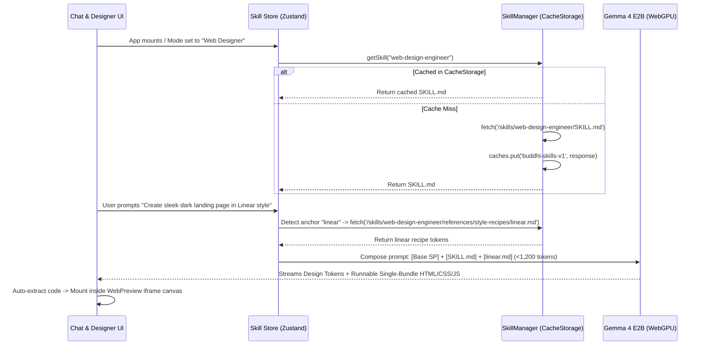

# Implementation Plan: Repurpose Buddhi-AI into a Client-Side AI Web & UI Designer

**Branch**: `v2` | **Date**: 2026-09-07 | **Spec**: [.buddhi/specs/002-repurpose-web-designer/spec.md](file:///c:/DevDojo/Buddhi/buddhi-ai/.buddhi/specs/002-repurpose-web-designer/spec.md)

**Input**: Feature specification from `/.buddhi/specs/002-repurpose-web-designer/spec.md`

---

## Summary

Repurpose `buddhi-ai` from a general chatbot into an on-device, privacy-preserving AI Web & UI Designer (a client-side alternative to Figma). Running entirely on WebGPU via `@litert-lm/core` and the `gemma-4-E2B-it-litert-lm` model, the feature implements:
1. **Progressive Disclosure AI Skill Engine**: A 3-tier static skill architecture hosted under `./public/skills/` with browser Cache Storage API persistence that injects only relevant instructions into the model's context window without memory bloat.
2. **Optimized `web-design-engineer` Skill**: Adapted from Garden Skills for a text-only, code-generating model—enforcing Design System declaration, rich CSS3/HTML5/SVG layout, and parametric Unsplash photo URLs.
3. **Interactive Sandboxed Canvas**: A Figma-like visual workspace powered by the existing Vercel AI Elements `WebPreview` component (`src/components/ai-elements/web-preview.tsx`), providing responsive viewport toggles (Desktop, Tablet, Mobile), instant iframe sandboxing, code inspection, and asset management.

---

## Technical Context

**Language/Version**: TypeScript 5, React 19, Next.js 16.3.4 (App Router)  
**Primary Dependencies**: 
- `@litert-lm/core` (on-device Gemma 4 E2B WebGPU inference)
- `@ai-sdk/react` & `ai` (client-side AI streaming and message state)
- `zustand` 5 (client state management)
- `streamdown` (streaming markdown & code blocks)
- Lucide React & Radix UI / Tailwind CSS v4

**Storage**:
- **Skills Cache**: Browser `CacheStorage` API (`caches.open('buddhi-skills-v1')`) with IndexedDB fallback for fast, zero-latency offline loading.
- **Chat & Artifact Storage**: Existing IndexedDB via `src/lib/chat-manager.ts`.
- **Canvas Assets**: Browser Object URLs (`URL.createObjectURL`) stored in a client-side asset registry for drag-and-drop local image support.

**Target Platform**: Web browsers with WebGPU support (Chrome, Edge, Brave, Arc on Windows, macOS, Linux).  
**Performance Goals**:
- Skill manifest load: `< 20ms` (cached) / `< 150ms` (initial fetch).
- System prompt overhead: `< 1,200 tokens` total for active skill (leaving $\ge 70\%$ of context window for generation).
- Preview render latency: `< 100ms` after HTML code block stream completes.
- Responsive canvas frame resize: `60 FPS` smooth transitions.

**Constraints**:
- **100% Client-Side**: Zero external server/backend calls required for AI inference or code execution.
- **Strict Iframe Sandboxing**: Sandboxed iframe for preview with `allow-scripts` and `allow-same-origin` (for blob/DOM rendering) while restricting top-level navigation.

---

## AGENTS.md Compliance Check

*GATE: Must pass before Phase 0 research. Re-check after Phase 1 design.*

- [x] **Project build & test commands adhered to**: Verified against Next.js 16 App Router and package scripts (`npm run build`, `npm run dev`).
- [x] **Architectural constraints respected**: Adheres to strict client-side WebGPU execution and zero telemetry/cloud backend constraints.
- [x] **No unapproved external dependencies introduced**: All required dependencies (`zustand`, `@ai-sdk/react`, `lucide-react`, `web-preview`) already exist in `package.json`.
- [x] **Design Guidelines**: Purple/violet AI cliché banned; curated high-contrast palettes, clean typography, and 8pt grid tokens enforced.

---

## Project Structure

### Documentation (this feature)

```text
.buddhi/specs/002-repurpose-web-designer/
├── spec.md              # Feature specification
├── plan.md              # Implementation plan (this file)
└── tasks.md             # Task breakdown (generated via /tasks)
```

### Source Code & Static Assets Layout

```text
public/
└── skills/
    ├── index.json                               # Tier 1: Lightweight skills catalog manifest
    └── web-design-engineer/
        ├── SKILL.md                             # Tier 2: Core skill prompt for Gemma 4 E2B
        └── references/
            ├── design-tokens.md                 # 8pt grid, contrast ratios, CSS variables
            ├── style-recipes/                   # Tier 3: Contextual design recipes
            │   ├── linear.md                    # Dark sleek tech / high precision
            │   ├── minimal-editorial.md         # Warm typography / clean white space
            │   └── modern-saas.md               # Crisp enterprise / glassmorphism
            └── anti-patterns.md                 # Cliché blocklist (no violet gradient blobs)

src/
├── lib/
│   └── skills/
│       ├── skill-manager.ts                     # Progressive disclosure loader & CacheStorage client
│       └── skill-injector.ts                    # Prompt composition & token budget validator
├── stores/
│   ├── skill-store.ts                           # Active skill state, mode toggle, loaded recipes
│   └── designer-canvas-store.ts                 # Viewport size (desktop/tablet/mobile), zoom/pan, active code
├── components/
│   ├── custom/
│   │   ├── chat/
│   │   │   ├── chat-session.tsx                 # Updated to support split canvas layout & skill selection
│   │   │   └── designer-mode-toggle.tsx         # Toggle between General Chat and Web & UI Designer mode
│   │   └── designer/
│   │       ├── designer-workspace.tsx           # Split view container (Chat on left, Canvas on right)
│   │       ├── designer-canvas.tsx              # Sandboxed WebPreview wrapper with zoom/pan & frame toggles
│   │       ├── viewport-toolbar.tsx             # 1440px / 768px / 375px responsive controls
│   │       ├── code-export-modal.tsx            # HTML/CSS copy & download drawer
│   │       └── asset-dropzone.tsx               # Drag & drop local image asset manager
│   └── ai-elements/
│       └── web-preview.tsx                      # Existing Vercel AI Elements sandboxed preview
└── const/
    └── system-prompts/
        └── web-designer.ts                      # Fallback embedded prompt if offline before skill cache
```

---

## Architecture & System Design Decisions

### 1. Progressive Disclosure Flow



### 2. Adaptation Strategy for `web-design-engineer`

| Upstream Garden Skill Feature | Constraint in Buddhi-AI | Tailored Optimization |
|---|---|---|
| **Image Generation Prompts** | Gemma 4 E2B is text-only | Uses parametric Unsplash URLs (`https://images.unsplash.com/photo-...`) + CSS gradient art |
| **CLI tools (`ffmpeg`, `yt-dlp`)** | In-browser client-side only | Removed. Zero external runtime binaries required |
| **Multi-Agent Subagent QA** | Single local model instance | Self-critique rubric embedded directly into Phase 1 of output |
| **External Asset Fetching** | Client-side sandbox | Asset Dropzone for drag-and-drop local images + inline SVGs / Lucide icons |
| **Full Catalog Injection** | 4k-8k token context window | 3-tier on-demand fetching; injects only the active recipe (~300 tokens) |

### 3. Canvas & Preview Architecture

- Utilizes existing `src/components/ai-elements/web-preview.tsx` as the core sandboxing layer.
- Wraps the iframe in a responsive viewport frame component:
  - **Desktop**: `1440px` (or `100%` fluid)
  - **Tablet**: `768px`
  - **Mobile**: `375px`
- Code extractor hook: Detects ```html / ```tsx code blocks in assistant streaming responses and synchronizes the active code state to `designer-canvas-store.ts`, updating the live preview without needing manual user copy-pasting.

---

## Phase Breakdown & Milestones

### Phase 1: Skill Infrastructure & Static Assets
- Scaffold `./public/skills/index.json` with manifest schema.
- Author `./public/skills/web-design-engineer/SKILL.md` optimized for Gemma 4 E2B.
- Author foundational style recipes (`linear.md`, `minimal-editorial.md`, `modern-saas.md`) and design tokens.
- Implement `src/lib/skills/skill-manager.ts` using the browser `CacheStorage` API.
- Implement `src/stores/skill-store.ts` for reactive skill loading.

### Phase 2: Gemma 4 E2B Prompt Injection & Transport Integration
- Connect `SkillManager` into `ChatSession` system prompt compilation pipeline (`getOptions` in `chat-session.tsx`).
- Implement intent detection & anchor matching (e.g., "Linear", "Minimalist") to trigger Tier 3 recipe loads.
- Validate token footprint to guarantee `< 1,200 tokens` system prompt overhead.

### Phase 3: Designer Workspace & Sandboxed Canvas
- Implement `DesignerWorkspace` split-view layout (chat + canvas).
- Implement `DesignerCanvas` wrapping `WebPreview` with viewport presets (`Desktop 1440px`, `Tablet 768px`, `Mobile 375px`) and zoom/pan.
- Add code auto-detection to pipe generated HTML blocks directly into the preview iframe.
- Add Code Export & Copy drawer.

### Phase 4: Asset Dropzone & Polish
- Implement `AssetDropzone` for dragging and dropping local images into the canvas.
- Provide local object URLs to prompt context for referencing uploaded brand assets.
- Add UI mode switcher ("General Chat" <-> "Web & UI Designer").

---

## Complexity Tracking

| Architectural Trade-Off | Why Needed | Simpler Alternative Rejected Because |
|---|---|---|
| **Public Directory + CacheStorage** | Allows instant on-demand progressive loading without increasing Next.js bundle size | Hardcoding skills as TypeScript strings in bundle permanently bloats initial JS download and wastes memory on unused skills. |
| **Sandboxed Iframe (`WebPreview`)** | Executes arbitrary user-generated HTML/CSS/JS safely without polluting the host Next.js app DOM or CSS | Injecting raw HTML via `dangerouslySetInnerHTML` risks CSS style leaks, script execution collisions, and security vulnerabilities. |
