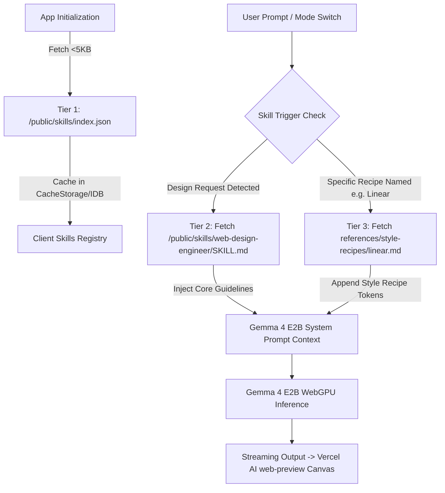

# Feature Specification: Repurpose Buddhi-AI into a Client-Side AI Web & UI Designer

**Feature Branch**: `002-repurpose-web-designer`  
**Created**: 2026-09-07  
**Status**: Ready for Planning  
**Input**: Repurpose `buddhi-ai` into a client-side AI Web & UI Designer alternative to Figma featuring Progressive Disclosure of AI Skills and an optimized `web-design-engineer` skill tailored for Gemma 4 E2B text-to-text generation.

---

## 1. Executive Summary & Vision

`buddhi-ai` is transitioning from a general-purpose chat interface into a dedicated, privacy-preserving, 100% client-side AI Web & UI Designer. Running entirely on-device via WebGPU and the lightweight `gemma-4-E2B-it-litert-lm` model, the app empowers designers and developers to conceptualize, iterate, and preview responsive web designs, landing pages, and interactive UI components without cloud subscription fees, telemetry, or server dependency.

This specification defines the first foundational milestone:
1. **Client-Side AI Skills Architecture (Progressive Disclosure)**: A 3-tier loading and caching mechanism located in `./public/skills/` that dynamically injects relevant skill guidance into the limited context window of Gemma 4 E2B without bloating memory or tokens.
2. **Optimized `web-design-engineer` Skill**: A trimmed, high-leverage adaptation of the Garden Skills `web-design-engineer` specifically tuned for a text-only, code-generating on-device LLM.
3. **Interactive Visual Canvas Workspace**: A Figma-like preview interface featuring Vercel AI Elements `web-preview` with isolated sandboxing, responsive viewport toggles, design token declaration, code inspection, and asset management.

---

## 2. User Scenarios & Testing

### User Story 1 - Progressive Disclosure & Skill Engine (Priority: P1)

As a designer using an on-device AI with limited context memory, I want the system to load only relevant skill guidance when needed so that the model runs fast, responds accurately, and does not run out of context or WebGPU memory.

**Why this priority**:
Gemma 4 E2B runs in browser WebGPU with a constrained context window (4k-8k tokens) and local KV-cache limits. Attempting to pass the full design skill catalog (which spans multiple guides, recipes, and rules) upfront will crash inference or dilute attention. Progressive Disclosure is the architectural backbone for any specialized capability.

**Independent Test**:
Can be verified by requesting a design in "Web Designer" mode, verifying via devtools network and cache storage that `/public/skills/index.json` is loaded first, followed by only `/public/skills/web-design-engineer/SKILL.md` when activated, leaving unreferenced recipes unloaded until explicitly triggered.

**Acceptance Scenarios**:
1. **Given** the app initializes, **When** loading the skills registry, **Then** only the lightweight manifest (`/public/skills/index.json`, < 5KB) is fetched and cached in Cache Storage / IndexedDB.
2. **Given** the user enters "Web & UI Designer" mode or prompts with a web design intent, **When** Gemma 4 E2B prepares its system prompt, **Then** the core `SKILL.md` content is retrieved from client cache and progressively injected without reloading other dormant skills.
3. **Given** the user specifies a specific visual recipe (e.g. "Linear style"), **When** the prompt is processed, **Then** only `references/style-recipes/linear.md` is fetched and injected dynamically (Tier 3), preserving token economy.

---

### User Story 2 - Gemma 4 E2B Optimized `web-design-engineer` Skill (Priority: P1)

As a creator requesting a landing page or UI design, I want the AI to generate high-aesthetic, production-grade, self-contained HTML/CSS/JS with intentional typography, gradients, glassmorphism, and inline SVGs instead of generic or broken output.

**Why this priority**:
Gemma 4 E2B is strictly text-to-text without native image generation or CLI execution. The skill prompt must maximize the model's strengths (clean semantic HTML, modern Tailwind/CSS3, responsive flex/grid layouts, SVG icons, and curated Unsplash imagery) while enforcing strong anti-cliché guardrails (no generic AI violet-purple gradients or boilerplate bootstrap cards).

**Independent Test**:
Can be verified by prompting "Design a hero section for an architectural studio". The model must output a 2-step response: (1) Design Read & Design Token declaration (palette, typography, spacing), followed by (2) a complete, runnable HTML/CSS/JS document containing inline SVGs and semantic layout.

**Acceptance Scenarios**:
1. **Given** the user requests a new interface, **When** Gemma 4 E2B generates the output, **Then** it first declares the Design System (color tokens, font hierarchy, border radius, spacing) before outputting code.
2. **Given** the model needs visual graphics, **When** generating code, **Then** it utilizes inline SVGs, CSS geometric art/gradients, and semantic Unsplash photo URLs (`https://images.unsplash.com/photo-...`) rather than broken local file paths or hallucinated image generation commands.
3. **Given** the generation completes, **When** evaluated, **Then** the code is completely self-contained in a single deliverable bundle ready for sandboxed iframe execution.

---

### User Story 3 - Interactive Canvas & Vercel AI Elements `web-preview` (Priority: P2)

As a designer iterating on visual layouts, I want to see the generated design render instantly in an interactive, sandboxed canvas alongside the chat, with responsive device frames and code inspection, so that I can validate the design like in Figma.

**Why this priority**:
A Figma alternative requires immediate visual feedback. Raw code in markdown code blocks is unusable for visual designers. Using Vercel AI Elements `web-preview` provides a safe sandbox, console logging, and responsive inspection.

**Independent Test**:
Can be verified by generating any UI component and seeing the `web-preview` panel immediately mount the sandboxed iframe, toggle between Desktop (1440px), Tablet (768px), and Mobile (375px), and permit source code tab inspection.

**Acceptance Scenarios**:
1. **Given** the AI streams or completes an HTML/CSS/JS artifact, **When** received by the UI, **Then** the `web-preview` component automatically mounts and displays the live visual preview without page refresh.
2. **Given** the user clicks the viewport switcher (Desktop / Tablet / Mobile), **When** toggled, **Then** the canvas frame smoothly resizes to 1440px, 768px, or 375px to test responsiveness.
3. **Given** the user wants to inspect or export the design, **When** clicking "View Code" or "Export", **Then** they can copy the clean HTML/CSS bundle or download it as an `.html` file.

---

### User Story 4 - Local Asset Drag & Drop Integration (Priority: P3)

As a designer with brand logos and product screenshots, I want to drag and drop images onto the canvas to use them in the generated designs.

**Why this priority**:
Because Gemma cannot generate raster images, allowing users to supply their own logos and assets bridges the gap between text-only generation and full Figma-grade brand fidelity.

**Independent Test**:
Can be verified by dragging an image into the canvas asset drawer, obtaining a client-side blob/object URL, and having the AI or user reference it directly in the design.

**Acceptance Scenarios**:
1. **Given** the user drops a PNG/SVG file onto the canvas, **When** dropped, **Then** the file is stored in client-side memory (Object URL / IndexedDB) and listed in the Canvas Asset drawer.
2. **Given** an asset is available, **When** prompting the AI with "Use the uploaded logo in the header", **Then** the generated code references the local asset URL correctly.

---

## 3. Architecture: Progressive Disclosure Mechanism

### Feasibility Analysis & Recommended Design

| Aspect | Static Public Directory (`./public/skills/`) | Embedded JS/TS Constants | Dynamic Server/API |
|---|---|---|---|
| **Feasibility** | **High (Optimal)** | Medium (Bloats JS bundle) | Low (Violates 100% client-side offline goal) |
| **Bandwidth/Memory** | Fetches only active skills on demand | Always loaded in main bundle memory | Requires ongoing server connection |
| **Caching** | Native HTTP Cache + Cache Storage API | Browser memory only | Network dependent |
| **Modularity** | Add/edit markdown skills without rebuilding app | Requires TypeScript re-compilation | Server coordination |

### The 3-Tier Progressive Disclosure Flow



1. **Tier 1 (Catalog Manifest - `/public/skills/index.json`)**:
   - Contains: `id`, `name`, `version`, `description` (short ~30 words), `triggers` (keywords/intents), `entryPoint` (`SKILL.md`), and `recipes` map.
   - Loaded once at app startup, size < 5KB. Cached persistently.
2. **Tier 2 (Core Skill - `/public/skills/<id>/SKILL.md`)**:
   - Contains: Core persona, Five Dials calibration, Design System declaration requirement, code bundling rules, and anti-cliché constraints.
   - Size: ~800 - 1200 tokens (well within Gemma 4 E2B's budget).
   - Fetched only when entering Web Designer mode or matching triggers.
3. **Tier 3 (Contextual References - `/public/skills/<id>/references/<name>.md`)**:
   - Contains: Specific style recipes (Linear, Aesop, Bloomberg, Mid-Century, etc.), color tokens, or domain checklists.
   - Fetched strictly on-demand when the user or prompt specifies that design direction.

---

## 4. Gemma 4 E2B Optimization for `web-design-engineer`

The upstream skill `https://github.com/ConardLi/garden-skills#web-design-engineer` includes features unsuitable for a client-side text-only edge model (e.g. `ffmpeg`/`yt-dlp` video frame grabbing, multi-agent browser test subagents, diffusion image prompting).

### Tailored Adaptations:
1. **Zero External Tool Dependencies**:
   - Eliminates terminal/CLI dependencies. All layout, styling, and interactivity are implemented in pure standard HTML5, CSS3, and modern JavaScript.
2. **Parametric Image Strategy**:
   - Formulates deterministic image URLs using Unsplash Source/API patterns (e.g. `https://images.unsplash.com/photo-...?...&auto=format&fit=crop&w=800&q=80`) with semantic topic tags.
   - Emphasizes SVG icons (using Lucide SVG syntax) and CSS illustrations (geometric shapes, gradients, shadows) over missing raster assets.
3. **Mandatory Two-Phase Output Structure**:
   - **Phase 1: Design System Declaration**:
     ```markdown
     ### Design Decisions
     - **Visual Language**: [Selected aesthetic]
     - **Palette**: Primary, Secondary, Neutral, Accent (HSL / Hex / oklch)
     - **Typography**: Display font, Body font (Google Fonts / System Fonts)
     - **Spacing & Radius**: Base 8px scale, radius tokens
     ```
   - **Phase 2: Self-Contained Web Artifact**:
     - Single complete executable HTML code block containing embedded `<style>` and `<script>` or modern Tailwind CDN.
4. **Anti-Cliché Guardrails for Edge AI**:
   - Explicit ban on the "AI generic purple/violet gradient hero".
   - Explicit requirement for high-contrast typography ratios (Title to body >= 2.5x).
   - Micro-interactions with CSS transitions (`transform`, `opacity`, `backdrop-filter`).

---

## 5. Functional Requirements

- **FR-001**: The system MUST store modular AI skill definitions in `./public/skills/` served as static assets.
- **FR-002**: The system MUST implement a client-side `SkillManager` that reads `/public/skills/index.json` and manages Cache Storage / IndexedDB caching for offline availability.
- **FR-003**: The system MUST dynamically compose the active system prompt for Gemma 4 E2B using Progressive Disclosure (loading only active skill and recipe files).
- **FR-004**: The system MUST provide an optimized `web-design-engineer` skill in `./public/skills/web-design-engineer/SKILL.md` tailored for Gemma 4 E2B text-only code generation.
- **FR-005**: The system MUST provide a hybrid activation mechanism: an explicit "Web & UI Designer" mode in the application sidebar/header, plus automatic intent routing for design-related queries.
- **FR-006**: The system MUST integrate Vercel AI Elements `web-preview` to render generated HTML/CSS/JS in an isolated, sandboxed iframe canvas.
- **FR-007**: The canvas MUST support responsive viewport switching (Desktop: 1440px, Tablet: 768px, Mobile: 375px) with zoom/pan controls.
- **FR-008**: The system MUST provide a code inspection drawer allowing users to view, copy, and export the generated design code.
- **FR-009**: The system MUST support local image drag-and-drop asset management with local URL generation for design referencing.

---

## 6. Success Criteria

- **SC-001 (Zero-Latency Skill Cache)**: Subsequent loads of cached skills from Cache Storage / IndexedDB MUST complete in under 50ms without network roundtrips.
- **SC-002 (Token Budget Compliance)**: The progressive disclosure injection for `web-design-engineer` MUST not exceed 1,500 tokens in the system prompt context, leaving >= 70% of Gemma 4 E2B's context window for conversation and generated code.
- **SC-003 (Instant Live Preview)**: Sandboxed iframe preview inside `web-preview` MUST render within 100ms of code generation completion.
- **SC-004 (100% Client-Side Independence)**: All skill retrieval, caching, AI inference (WebGPU), and visual rendering MUST function completely offline once assets are cached.
- **SC-005 (Figma-Like Usability)**: Users can switch viewports, inspect design tokens, and export production-ready HTML with a single click.

---

## 7. Edge Cases & Boundary Conditions

- **Offline Mode**: If the user is offline on first launch before skills are cached, fallback embedded defaults must be loaded gracefully.
- **Context Limit Exceeded**: If the conversation grows large, the client-side context manager must preserve the active skill instructions while summarizing older chat turns.
- **Iframe Script Hijacking / Security**: The `web-preview` sandboxed iframe must restrict unsafe top-level navigation while permitting necessary CSS animations, DOM interactions, and CDN scripts (e.g. Tailwind / Lucide).
- **Broken External Images**: When Unsplash images fail to load or offline mode is active, CSS fallback background gradients must ensure the layout remains visually polished.

---

## 8. Assumptions

- Target devices support WebGPU (Chrome/Edge/Brave on Windows, macOS, Linux with modern GPU).
- `@litert-lm/core` continues to manage the on-device `gemma-4-E2B-it-web.litertlm` execution in web workers.
- Vercel AI Elements `web-preview` components (`@ai-sdk/react` or elements packages) can be styled to match Buddhi-AI's design aesthetic.
