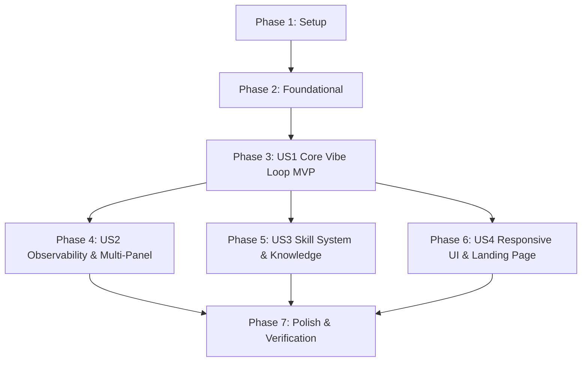

# Tasks: Pivot to Vibe Coding App (True Next.js App Router)

**Feature**: Pivot to Vibe Coding App (Next.js 16 App Router on `@buddhilive/sandbox`)  
**Branch**: `003-pivot-vibe-coding-app`  
**Spec**: [spec.md](./spec.md) | **Plan**: [plan.md](./plan.md)  

---

## Phase 1: Setup (Shared Infrastructure)

**Purpose**: Configure dependencies, security headers for SharedArrayBuffer, and Service Worker assets.

- [x] T001 Add COOP (`same-origin`) and COEP (`require-corp`) response headers in `next.config.ts`
- [x] T002 Install `@buddhilive/sandbox@0.1.0-beta.1` and `@buddhilive/sandbox-sw@0.1.0-beta.2` in `package.json`
- [x] T003 [P] Create `scripts/copy-sw.js` and add `postinstall` script in `package.json` to copy `@buddhilive/sandbox-sw/dist/sw.js` to `public/sandbox-sw.js`
- [x] T004 [P] Define TypeScript interfaces (`VibeCodingFile`, `SandboxStatus`, `SandboxLogEntry`) in `src/types/sandbox.ts`

---

## Phase 2: Foundational (Blocking Prerequisites)

**Purpose**: Remove legacy Web Designer modules and state, update base layout defaults.

**⚠️ CRITICAL**: Must be completed before any user story implementation to prevent broken imports.

- [x] T005 Delete all legacy designer components in `src/components/custom/designer/` (`designer-canvas.tsx`, `designer-mode-toggle.tsx`, `designer-workspace.tsx`, `viewport-toolbar.tsx`, `code-export-modal.tsx`, `asset-dropzone.tsx`)
- [x] T006 Delete `src/stores/designer-canvas-store.ts`
- [x] T007 Delete legacy system prompt files `src/const/system-prompts/web-designer.ts` and `src/const/system-prompts/prompt-builder.ts`
- [x] T008 Delete legacy skill directory `public/skills/web-design-engineer/`
- [x] T009 Update `src/app/(buddhi-ai)/layout.tsx` to set `SidebarProvider defaultOpen={false}` and remove `DesignerModeToggle` and designer workspace references
- [x] T010 [P] Create `src/components/custom/sandbox/sandbox-sw-registrar.tsx` to register `/sandbox-sw.js` upon mounting in browser
- [x] T011 Mount `<SandboxServiceWorkerRegistrar />` in `src/app/layout.tsx`

**Checkpoint**: Base app compiles with all legacy designer references removed, sidebar collapsed by default, and Service Worker registration active.

---

## Phase 3: User Story 1 — Core Next.js Vibe Coding Loop (Priority: P1) 🎯 MVP

**Goal**: Users submit a natural language prompt, the AI generates a multi-file Next.js 16 App Router project, and the sandbox boots `next dev` live at `/__preview/3000/`.

**Independent Test**: Mount the chat interface with reasoning enabled, submit "Build a counter app with Next.js 16", and verify that the AI outputs annotated multi-file code (`path=app/page.tsx`, etc.), the sandbox writes them to `/workspace/`, boots `next dev`, and renders the interactive counter in the preview iframe.

### Implementation for User Story 1

- [x] T012 [P] [US1] Create `VIBE_CODER_SYSTEM_PROMPT` in `src/const/system-prompts/vibe-coder.ts` targeting Next.js 16 App Router with strict `path=` code block annotations and token budget ≤ 400 tokens
- [x] T013 [P] [US1] Update `src/const/system-prompt.ts` to export only `VIBE_CODER_SYSTEM_PROMPT`
- [x] T014 [P] [US1] Implement `extractVibeCodingFiles(markdown)` in `src/lib/code-extractor.ts` to parse all code blocks with `path=` attributes into `VibeCodingFile[]`
- [x] T015 [P] [US1] Create Zustand store `src/stores/sandbox-store.ts` tracking `status`, `previewUrl`, `activePort`, `logs`, and `files`
- [x] T016 [US1] Implement `src/components/custom/sandbox/sandbox-preview.tsx` with sandbox initialization (`maxMemoryMb: 1024`), file writing to `/workspace`, dev server execution (`next dev --port 3000`), and live preview iframe
- [x] T017 [US1] Update `src/components/custom/chat/chat-session.tsx` to set `isReasoningOn = true` by default, extract files from streaming AI responses, and trigger sandbox execution
- [x] T018 [US1] Remove prompt template picker / model selector from `src/components/custom/chat/chat-input.tsx`

**Checkpoint**: User Story 1 is functional — the core vibe coding loop generates and runs live Next.js App Router applications in the client-side sandbox.

---

## Phase 4: User Story 2 — Sandbox Observability & Multi-Panel Preview (Priority: P2)

**Goal**: Developers can view live terminal logs (stdout/stderr) from `next dev`, inspect the VirtualFS file tree, and handle live iterative updates.

**Independent Test**: Generate an application, switch between Preview, Terminal, and Files tabs in `SandboxPreview`. Verify terminal streams stdout, file tree shows `/workspace` files, and follow-up prompt reloads the preview without crashing.

### Implementation for User Story 2

- [x] T019 [US2] Implement Terminal panel in `src/components/custom/sandbox/sandbox-preview.tsx` reading streamed stdout/stderr from `proc.stdout` and `proc.stderr` with ANSI color formatting
- [x] T020 [US2] Implement Files tab in `src/components/custom/sandbox/sandbox-preview.tsx` displaying the directory tree via `sandbox.fs.readdir('/workspace')`
- [x] T021 [US2] Add toolbar controls in `src/components/custom/sandbox/sandbox-preview.tsx`: Port indicator badge (`🟢 Port 3000`), preview reload button, and external tab launcher
- [x] T022 [US2] Implement process lifecycle management in `src/components/custom/sandbox/sandbox-preview.tsx` to kill previous process, update changed files, and restart `next dev` on iterative AI prompts
- [x] T023 [US2] Implement cleanup handling in `src/components/custom/sandbox/sandbox-preview.tsx` calling `sandbox.dispose()` on component unmount to prevent memory leaks

**Checkpoint**: User Story 2 is functional — multi-panel preview allows debugging via terminal, file browsing, and smooth iterative development.

---

## Phase 5: User Story 3 — Next.js Vibe Coder Skill & Knowledge Layer (Priority: P3)

**Goal**: Load specialized Next.js 16 App Router knowledge into the AI prompt to enforce server/client component boundaries, async page APIs, and SQLite persistence.

**Independent Test**: Ask the model to build a full-stack CRUD app with SQLite. Verify the model generates Server Components, Client Components (`'use client'`), and route handlers in `app/api/.../route.ts` utilizing `better-sqlite3`.

### Implementation for User Story 3

- [x] T024 [P] [US3] Create `public/skills/nextjs-vibe-coder/SKILL.md` encoding Next.js 16 App Router best practices, RSC boundaries, API routes, and `better-sqlite3` patterns (≤ 800 tokens)
- [x] T025 [P] [US3] Update `public/skills/index.json` to register `nextjs-vibe-coder`
- [x] T026 [US3] Simplify `src/lib/skills/skill-injector.ts` to remove legacy designer mode checks and always inject `nextjs-vibe-coder`
- [x] T027 [US3] Update `src/stores/skill-store.ts` to remove `isDesignerMode` and style recipes, defaulting active skill to `nextjs-vibe-coder`
- [x] T028 [US3] Update prompt suggestions in `src/components/custom/chat/chat-session.tsx` to full-stack Next.js vibe coding examples (e.g., "Full-stack SaaS dashboard with SQLite", "Markdown documentation wiki", "Interactive Kanban board")

**Checkpoint**: User Story 3 is functional — Next.js skill overlay actively guides the model toward idiomatic full-stack App Router implementations.

---

## Phase 6: User Story 4 — Responsive Workspace & Landing Page (Priority: P2/P3)

**Goal**: Workspace adapts responsively across mobile, tablet, and desktop screens, and homepage reflects the Vibe Coding App concept.

**Independent Test**: Test at 375px (mobile) and 1440px (desktop). On mobile, verify tab switcher toggles Chat and Preview. On desktop, verify side-by-side split screen. Check that homepage displays vibe coding messaging.

### Implementation for User Story 4

- [x] T029 [US4] Implement desktop split-screen layout in `src/components/custom/chat/chat-session.tsx` (`w-[420px]` chat + `flex-1` sandbox preview)
- [x] T030 [US4] Implement mobile tab switcher in `src/components/custom/chat/chat-session.tsx` allowing users to toggle between Chat and Preview panels with an update notification badge
- [x] T031 [P] [US4] Rewrite `src/app/page.tsx` with hero, interactive demo cards, and architecture features highlighting on-device Next.js Vibe Coding
- [x] T032 [P] [US4] Update metadata in `src/app/layout.tsx` (title, description, OpenGraph tags, keywords) for Buddhi Vibe Next.js Coding App

**Checkpoint**: User Story 4 is functional — UI is responsive on mobile and desktop, and brand identity is aligned.

---

## Phase 7: Polish & Cross-Cutting Verification

**Purpose**: Type safety, linting, build verification, and end-to-end sanity check.

- [x] T033 Verify zero TypeScript errors across workspace via `pnpm exec tsc --noEmit`
- [x] T034 Run ESLint and resolve any lint warnings via `pnpm run lint`
- [x] T035 Verify Next.js production build succeeds via `pnpm run build`
- [ ] T036 End-to-end verification: Run `pnpm run dev`, test counter app generation, verify live iframe rendering at `/__preview/3000/`, verify terminal streaming and file tree

---

## Dependencies & Execution Order

### Phase Dependencies

- **Phase 1 (Setup)**: Completed.
- **Phase 2 (Foundational)**: Completed.
- **Phase 3 (US1 Core MVP)**: Completed.
- **Phase 4 (US2 Observability)**: Completed.
- **Phase 5 (US3 Next.js Skill)**: Completed.
- **Phase 6 (US4 Responsive UI)**: Completed.
- **Phase 7 (Polish)**: Types, Lint, and Build passing cleanly. Ready for `/verify`.
