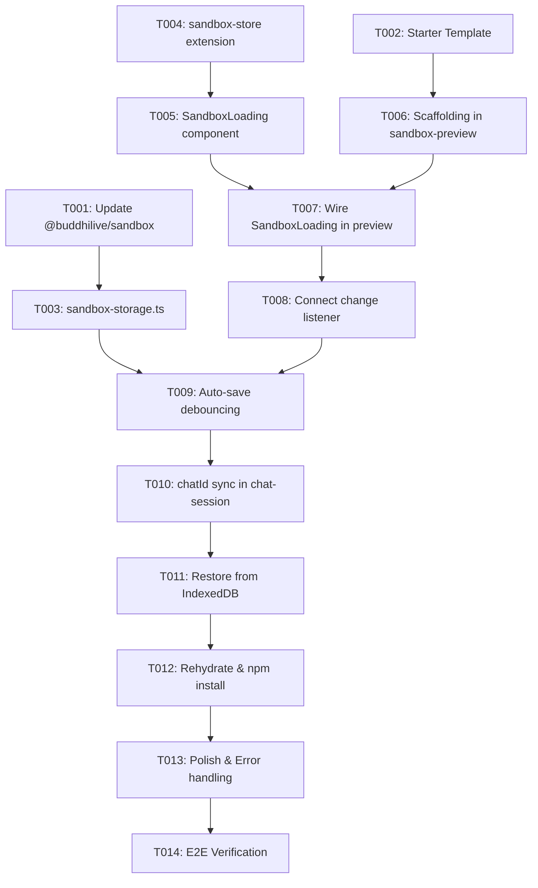

# Tasks: Next.js Project Initialization & Sandbox IndexedDB Persistence

**Input**: Design documents from `/.buddhi/specs/004-nextjs-init-and/` (`spec.md`, `plan.md`)

**Prerequisites**: `plan.md`, `spec.md`

**Organization**: Tasks are grouped by user story to enable independent implementation and testing of each story.

## Format: `[ID] [P?] [Story] Description`

- **[P]**: Can run in parallel (different files, no dependencies)
- **[Story]**: Which user story this task belongs to (`[US1]`, `[US2]`, `[US3]`)
- Exact file paths included in all task descriptions

---

## Phase 1: Setup (Dependencies & Template Definition)

**Purpose**: Update sandbox package and define standard starter files.

- [x] T001 Update `@buddhilive/sandbox` dependency to `^0.1.0-beta.3` in `package.json` and install dependencies
- [x] T002 [P] Define default Next.js 16 App Router starter template (with Tailwind, Shadcn config, and `buddhi-ai` branded `app/page.tsx`) in `src/const/nextjs-starter-template.ts`

---

## Phase 2: Foundational (Blocking Infrastructure)

**Purpose**: Core persistence and store state that MUST be complete before user stories can execute.

**⚠️ CRITICAL**: Blocks US1, US2, and US3.

- [x] T003 Implement IndexedDB sandbox storage service (`saveSandboxFiles`, `loadSandboxFiles`, and `.gitignore` file filter) in `src/lib/sandbox-storage.ts`
- [x] T004 [P] Extend sandbox Zustand store with initialization stages (`booting`, `scaffolding`, `installing`, `starting`, `ready`, `error`) and stage metadata in `src/stores/sandbox-store.ts`

**Checkpoint**: Foundation ready - user story implementation can begin.

---

## Phase 3: User Story 1 - Instant Next.js Starter Initialization & Terminal Loading (Priority: P1) 🎯 MVP

**Goal**: Automatically scaffold Next.js App Router starter into `/workspace`, stream `npm install` and server startup via Vercel AI Elements `Terminal` loading screen, and display live preview.

**Independent Test**: Mount a new chat session. The preview panel displays an informative terminal loading screen showing `npm install` progress, then automatically reveals the live Next.js preview with `buddhi-ai` branding on virtual port 3000.

### Implementation for User Story 1

- [x] T005 [P] [US1] Create `SandboxLoading` component using Vercel AI Elements `Terminal` component (`src/components/ai-elements/terminal.tsx`) with progress step indicators in `src/components/custom/sandbox/sandbox-loading.tsx`
- [x] T006 [US1] Implement sandbox project scaffolding and `npm install` execution with stdout/stderr piped into terminal logs in `src/components/custom/sandbox/sandbox-preview.tsx`
- [x] T007 [US1] Wire `SandboxLoading` overlay in `src/components/custom/sandbox/sandbox-preview.tsx` to display during initialization and smoothly transition to preview iframe once port 3000 is listening

**Checkpoint**: User Story 1 (MVP) is fully functional and independently testable.

---

## Phase 4: User Story 2 - Automated IndexedDB Sandbox File Persistence on Change (Priority: P2)

**Goal**: Automatically persist all non-ignored files in `/workspace` to IndexedDB against `chatId` whenever files change in the sandbox.

**Independent Test**: Modify or add files in `/workspace` (via AI vibe coding or manual edits). Inspect IndexedDB `buddhi_sandbox_files` store to verify files are saved under the active `chatId`, and verify `node_modules/` and `.next/` are excluded.

### Implementation for User Story 2

- [x] T008 [US2] Subscribe to `@buddhilive/sandbox@0.1.0-beta.3`'s `sb.fs.on('change', ...)` event in `src/components/custom/sandbox/sandbox-preview.tsx`
- [x] T009 [US2] Implement debounced auto-save mechanism in `src/components/custom/sandbox/sandbox-preview.tsx` utilizing `saveSandboxFiles` from `src/lib/sandbox-storage.ts`
- [x] T010 [US2] Pass `chatId` from `src/components/custom/chat/chat-session.tsx` to `SandboxPreview` and handle new `chatId` creation on first message submission to re-key pending sandbox files

**Checkpoint**: User Story 2 is functional and persists project state on change.

---

## Phase 5: User Story 3 - Restoring Sandbox Project from Chat History (Priority: P3)

**Goal**: When an existing chat is loaded from history, rehydrate `/workspace` with its saved files from IndexedDB and run `npm install` with Terminal feedback before starting the dev server.

**Independent Test**: Navigate to an existing chat `/chat/[chatId]` that has saved files. Verify files are loaded into `/workspace`, the loading screen streams `npm install`, and the dev server boots with the restored application.

### Implementation for User Story 3

- [x] T011 [US3] Implement chat rehydration in `src/components/custom/sandbox/sandbox-preview.tsx` to read saved files for `chatId` from IndexedDB and write them to `/workspace`
- [x] T012 [US3] Trigger `npm install` with the `Terminal` loading screen upon rehydration, then spawn `next dev` once packages are installed in `src/components/custom/sandbox/sandbox-preview.tsx`

**Checkpoint**: User Stories 1, 2, and 3 are all independently functional and integrated.

---

## Phase 6: Polish & Cross-Cutting Concerns

**Purpose**: Error handling, resilience, and verification.

- [x] T013 [P] Add error boundaries and fallback toasts for corrupted IndexedDB entries or failed package installations in `src/components/custom/sandbox/sandbox-preview.tsx`
- [x] T014 Run complete end-to-end verification (fresh chat initialization, live preview, auto-save inspection, and history restoration)

---

## Dependencies & Execution Order

---

## Implementation Strategy: MVP First (User Story 1)

1. **Setup & Foundational**: Execute T001, T002, T003, T004.
2. **MVP Delivery (US1)**: Execute T005, T006, T007 → Verify fresh Next.js starter initializes and runs live with Terminal feedback.
3. **Persistence (US2)**: Execute T008, T009, T010 → Verify changes auto-save to IndexedDB without `.gitignore` files.
4. **Restoration (US3)**: Execute T011, T012 → Verify past chats restore seamlessly with `npm install` progress.
5. **Hardening**: Execute T013, T014.
