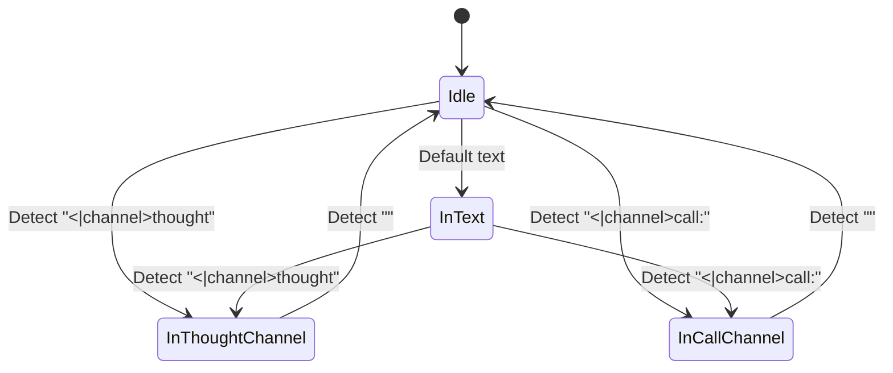
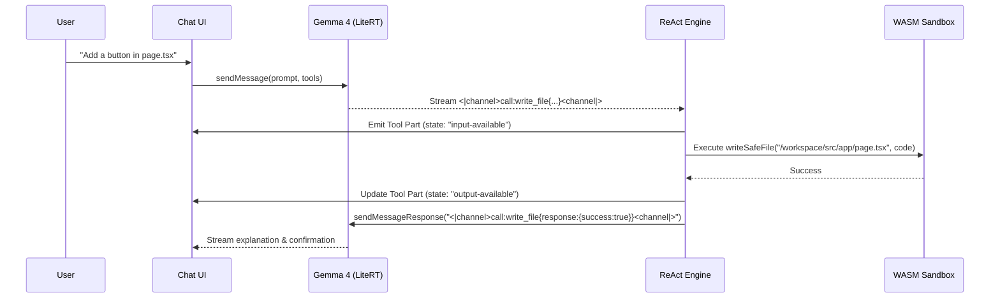

# Implementation Plan: ReAct Coding Agent, Gemma 4 Thinking Fixes, and UI Cleanup

**Branch**: `005-react-coding-agent` | **Date**: 2026-09-11 | **Spec**: [.buddhi/specs/005-react-coding-agent/spec.md](file:///C:/DevDojo/Buddhi/buddhi-ai/.buddhi/specs/005-react-coding-agent/spec.md)

**Input**: Feature specification from `/.buddhi/specs/005-react-coding-agent/spec.md`

---

## Summary

This plan outlines the architecture and execution strategy to:
1. **Fix Gemma 4 Thinking Tag Rendering**: Replace the brittle newline-dependent thinking header check with a robust channel-based streaming parser that cleanly strips `<|channel>thought...<channel|>` delimiters across streaming fragments and routes internal reasoning exclusively to the collapsible `<Reasoning>` component.
2. **Implement ReAct Sandbox Coding Tools**: Expose the standard sandbox toolset (`write_file`, `read_file`, `list_files`, `run_command`) to Gemma 4 in its native tool calling format (`<|channel>call:name{...}<channel|>`), backed by a client-side ReAct execution loop that operates directly on the active WebAssembly POSIX sandbox filesystem and process engine.
3. **Render Tool Invocations with AI Elements `Tool`**: Integrate `@/components/ai-elements/tool.tsx` into `ChatMessages` to provide live visual status badges ("Running", "Completed", "Error"), collapsible inputs, and formatted outputs.
4. **Remove "Next.js Vibe Coding Prompts"**: Clean up `chat-session.tsx` to display a minimalist, distraction-free empty state.

---

## Technical Context

**Language/Version**: TypeScript 5.x / Next.js 16 (App Router) / React 19  
**Primary Dependencies**: `@buddhilive/sandbox`, `@google/litert-core`, `@ai-sdk/ui-utils` / `ai`, `lucide-react`, `zustand`, `tailwindcss`  
**Storage**: IndexedDB (for sandbox workspace files snapshot via `idb-keyval` / `sandbox-storage.ts`)  
**Testing**: Vitest / Playwright / TypeScript compiler check (`pnpm typecheck` / `tsc --noEmit`)  
**Target Platform**: Modern Web Browsers with WebAssembly POSIX + SharedArrayBuffer support  
**Project Type**: In-browser AI-powered Next.js development environment  
**Performance Goals**: Zero perceptible streaming latency; tool executions complete and sync within <500ms; Next.js HMR reloads preview within <3s  
**Constraints**: Pure client-side execution (LiteRT/MediaPipe in browser + WebAssembly Sandbox in browser); memory quota 1024MB; SharedArrayBuffer required for sandbox  

---

## AGENTS.md Compliance Check

- [x] Project build & test commands adhered to (`pnpm build`, `pnpm lint`, `pnpm check-types`)
- [x] Architectural constraints respected (Gemma 4 prompt format, WebAssembly sandbox POSIX boundary, Next.js App Router rules)
- [x] No unapproved external dependencies introduced (uses existing `@buddhilive/sandbox`, AI Elements `tool.tsx`, and standard packages)

---

## Project Structure

### Documentation (this feature)

```text
.buddhi/specs/005-react-coding-agent/
├── spec.md              # Feature specification
├── plan.md              # This architecture & implementation plan
└── tasks.md             # Actionable, prioritized task checklist (Phase 2 output)
```

### Source Code Impact

```text
src/
├── types/
│   ├── messages.ts                   # Add tool definition schemas & channel types
│   └── sandbox.ts                    # Add SandboxToolExecution & ReAct step types
├── stores/
│   └── sandbox-store.ts              # Store active Sandbox bridge / execution helper
├── lib/
│   ├── buddhi-ai-core/
│   │   ├── chat-api.ts               # Channel-aware streaming parser & ReAct loop
│   │   └── chat-template-generator.ts# Gemma 4 native tool call declarations & serialization
│   └── sandbox-tools.ts              # Implementation of write_file, read_file, list_files, run_command
└── components/
    ├── custom/
    │   ├── chat/
    │   │   ├── chat-messages.tsx     # Render Tool component for tool invocations
    │   │   └── chat-session.tsx      # Remove Vibe Coding Prompts & wire ReAct loop
    │   └── sandbox/
    │       └── sandbox-preview.tsx   # Register Sandbox instance to store on mount
    └── ai-elements/
        └── tool.tsx                  # Pre-existing AI Elements Tool UI component
```

---

## Architecture & Design Decisions

### 1. Robust Gemma 4 Channel Stream Parser

**Problem**: Gemma 4 emits thought reasoning and tool calls within channel tags:
- `<|channel>thought ... <channel|>` (may appear multiple times in a stream, with variable whitespace e.g. `<|channel>thought Process<channel|> <|channel>thought :<channel|>`).
- `<|channel>call:tool_name{arguments}<channel|>`.

The current parser in `chat-api.ts` checked only `accumulated.startsWith("<|channel>thought\n")`. Because chunks often start without `\n` or alternate between channels, the check failed immediately, causing raw channel tokens to leak into visible text.

**Solution: Sliding-Window Channel State Machine**


- When entering `<|channel>thought`, tag text is consumed and NOT emitted to visible text. Content inside is forwarded to `reasoning-delta` (if `isReasoningOn`) or ignored (if reasoning off).
- When encountering `<channel|>`, reasoning ends cleanly with `reasoning-end`.
- When entering `<|channel>call:name{...}<channel|>`, tag text is buffered until closing `<channel|>`. The tool name and arguments are parsed and emitted as a `tool-call` part with state `input-available`.
- Any text outside channels is emitted as normal `text-delta` after stripping any dangling control tokens.

### 2. Sandbox Toolset & ReAct Autonomous Loop

**Tools Defined**:
1. `write_file(path: string, content: string)`:
   - Writes file to `/workspace/<path>`, ensures parent directories exist, synchronizes with virtual filesystem, updates IndexedDB cache.
   - Return format: `{ success: true, path, bytesWritten: number }`.
2. `read_file(path: string)`:
   - Reads file from `/workspace/<path>` (UTF-8).
   - Return format: `{ success: true, path, content: string }` or `{ error: string }`.
3. `list_files(path?: string, recursive?: boolean)`:
   - Scans `/workspace` directory, filtering ignored paths (`node_modules`, `.next`, etc.).
   - Return format: `{ success: true, files: string[] }`.
4. `run_command(command: string, args?: string[])`:
   - Runs command in the WebAssembly POSIX sandbox workspace using `Sandbox.commands.run`.
   - Captures stdout, stderr, and exit code.
   - Return format: `{ exitCode: number, stdout: string, stderr: string }`.

**ReAct Execution Flow**:


### 3. UI Integration with `@/components/ai-elements/tool.tsx`

`ChatMessages` maps over `message.parts`. For each part:
- If `part.type === "dynamic-tool"` or `part.type.startsWith("tool-")`:
  - Renders `<Tool defaultOpen={false}>`.
  - `<ToolHeader toolName={part.toolName} state={part.state} type="dynamic-tool" />`.
  - `<ToolContent>`:
    - `<ToolInput input={part.args} />` (collapsible code block showing path/command).
    - `<ToolOutput output={part.output} errorText={part.error} />` (collapsible result inspection).

### 4. Empty State Cleanup

In `chat-session.tsx`:
- Delete the `{messages.length === 0 && (<div ...>Next.js Vibe Coding Prompts...</div>)}` block.
- Render a clean, non-intrusive container when `messages.length === 0`.

---

## Phase 0: Research & Grounding

- Validated `@buddhilive/sandbox` API:
  - `sb.fs.writeFile`, `sb.fs.readFile`, `sb.fs.readdir`, `sb.fs.mkdir`, `sb.commands.run`.
- Validated Gemma 4 Prompt and Channel documentation:
  - Turn delimiters: `<|turn>system`, `<|turn>user`, `<|turn>model`, `<turn|>`.
  - Thinking channel: `<|channel>thought\n{reasoning}<channel|>`.
  - Call channel: `<|channel>call:{name}{arguments}<channel|>`.
  - Return channel: `<|channel>call:{name}{response:{...}}<channel|>`.
- Validated AI Elements Tool component:
  - Available at `src/components/ai-elements/tool.tsx` with full support for `DynamicToolUIPart` and state transitions (`input-available`, `output-available`, `output-error`).

---

## Phase 1: Contracts & Interfaces

### 1. Tool Declaration Schemas

```typescript
export const SANDBOX_TOOLS: BuddhiAIToolDefinition[] = [
  {
    name: "write_file",
    description: "Create or overwrite a file in the project workspace (/workspace).",
    parameters: {
      path: { type: "string", description: "Relative file path from workspace root (e.g. src/app/page.tsx)" },
      content: { type: "string", description: "Full content of the file to write" }
    },
    required: ["path", "content"]
  },
  {
    name: "read_file",
    description: "Read the full text content of a file in the project workspace.",
    parameters: {
      path: { type: "string", description: "Relative file path from workspace root (e.g. package.json)" }
    },
    required: ["path"]
  },
  {
    name: "list_files",
    description: "List files in the workspace directory tree.",
    parameters: {
      path: { type: "string", description: "Subdirectory to list (defaults to root)" }
    }
  },
  {
    name: "run_command",
    description: "Run a shell command inside the WebAssembly sandbox workspace.",
    parameters: {
      command: { type: "string", description: "Shell command line to execute (e.g. npm install lucide-react)" }
    },
    required: ["command"]
  }
];
```

### 2. Sandbox Bridge in Store

```typescript
interface SandboxBridge {
  writeFile: (path: string, content: string) => Promise<{ success: boolean; bytesWritten: number; path: string }>;
  readFile: (path: string) => Promise<{ success: boolean; content: string; path: string }>;
  listFiles: (path?: string) => Promise<{ success: boolean; files: string[] }>;
  runCommand: (command: string) => Promise<{ exitCode: number; stdout: string; stderr: string }>;
}
```

---

## Phase 2: Implementation Breakdown

### Workstream 1: Gemma 4 Stream Channel Parser (P1)
- Implement sliding-window / regex-assisted channel extraction in `src/lib/buddhi-ai-core/chat-api.ts`.
- Detect all variations of `<|channel>thought` without requiring strict trailing newlines.
- Strip all opening `<|channel>thought` and closing `<channel|>` tags.
- Stream reasoning into `reasoning-delta` when `isReasoningOn` is true; suppress when false.
- Detect `<|channel>call:name{...}<channel|>` and isolate from normal text stream.

### Workstream 2: Sandbox Tools & ReAct Engine (P1)
- Create `src/lib/sandbox-tools.ts` implementing `write_file`, `read_file`, `list_files`, `run_command`.
- Update `sandbox-preview.tsx` and `sandbox-store.ts` to register the active Sandbox bridge.
- Implement ReAct multi-turn loop in `chat-session.tsx` / `chat-api.ts`:
  - When model emits a tool call, pause text stream, emit tool UI part (`input-available`).
  - Execute tool via Sandbox bridge.
  - On success, update tool UI part (`output-available`) with output.
  - On error, update tool UI part (`output-error`) with error message.
  - Automatically feed tool response back into conversation turn and call `sendMessageStreaming` to let the model continue.

### Workstream 3: Tool UI Rendering in Chat (P2)
- Update `src/components/custom/chat/chat-messages.tsx` to import `Tool`, `ToolHeader`, `ToolContent`, `ToolInput`, `ToolOutput` from `@/components/ai-elements/tool`.
- Render dynamic tool parts with appropriate state badges ("Running", "Completed", "Error").
- Ensure collapsible view allows inspecting the written code / file path and command output.

### Workstream 4: Empty State Cleanup (P3)
- Remove `Next.js Vibe Coding Prompts` suggestions container from `src/components/custom/chat/chat-session.tsx`.
- Verify clean layout when `messages.length === 0`.

---

## Verification Plan

### Automated Tests
1. `pnpm check-types` / `tsc --noEmit`: Ensure all message types, tool definitions, and store methods type-check cleanly.
2. Unit test for channel stream parser: Test various chunk boundaries (split `<|channel>`, split `thought`, multiple thought blocks, interleaved tool calls).

### Manual Verification
1. **Thinking Mode Verification**:
   - Send prompt with reasoning ON: Verify thought process appears inside the `<Reasoning>` collapsible block with NO `<|channel>thought` or `<channel|>` text visible.
   - Send prompt with reasoning OFF: Verify no thought tags appear in chat.
2. **ReAct Coding Agent Verification**:
   - Ask agent: "Change the home page title in `src/app/page.tsx` to 'Hello ReAct'".
   - Observe `<Tool>` element rendering in chat: "write_file" with status badge transitioning from "Running" to "Completed".
   - Confirm the Next.js preview immediately reflects the updated heading without manual copy-paste.
3. **Empty State Verification**:
   - Refresh or create a new chat: Confirm no "Next.js Vibe Coding Prompts" buttons or headers appear.
