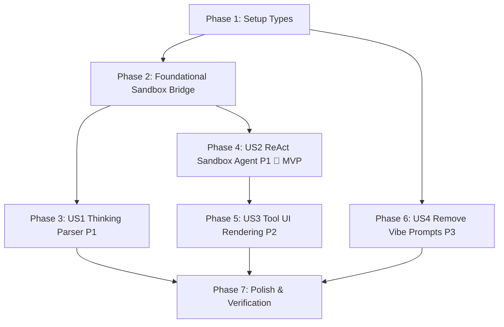

# Tasks: ReAct Coding Agent, Gemma 4 Thinking Fixes, and UI Cleanup

**Branch**: `005-react-coding-agent` | **Spec**: [.buddhi/specs/005-react-coding-agent/spec.md](file:///C:/DevDojo/Buddhi/buddhi-ai/.buddhi/specs/005-react-coding-agent/spec.md) | **Plan**: [.buddhi/specs/005-react-coding-agent/plan.md](file:///C:/DevDojo/Buddhi/buddhi-ai/.buddhi/specs/005-react-coding-agent/plan.md)

---

## Phase 1: Setup (Shared Infrastructure)

**Purpose**: Type definitions and shared schemas

- [x] T001 [P] Update `src/types/messages.ts` with Gemma 4 channel types and tool call/response schemas.
- [x] T002 [P] Update `src/types/sandbox.ts` with SandboxToolExecution and ReAct tool payload types.

---

## Phase 2: Foundational (Blocking Prerequisites)

**Purpose**: Core sandbox tool execution infrastructure that MUST be complete before user stories can begin

**⚠️ CRITICAL**: Blocks ReAct agent execution

- [x] T003 Add active Sandbox instance reference and tool execution dispatcher to `src/stores/sandbox-store.ts`.
- [x] T004 Register active `Sandbox` instance with `useSandboxStore` on mount/initialization in `src/components/custom/sandbox/sandbox-preview.tsx`.
- [x] T005 Create `src/lib/sandbox-tools.ts` with implementations for `write_file`, `read_file`, `list_files`, and `run_command` operating on the WebAssembly Sandbox virtual filesystem and process engine.

**Checkpoint**: Sandbox bridge ready — tool execution can now be invoked programmatically.

---

## Phase 3: User Story 1 - Gemma 4 Thinking Mode & Tag Parsing (Priority: P1)

**Goal**: Eliminate `<|channel>thought` and `<channel|>` tag leakage, streaming reasoning cleanly to the `<Reasoning>` component.

**Independent Test**: Submit a prompt with reasoning ON; confirm thoughts appear in the collapsible reasoning panel without raw channel tokens leaking into visible chat text.

- [x] T006 [US1] Implement robust sliding-window channel parser in `src/lib/buddhi-ai-core/chat-api.ts` to detect `<|channel>thought` across variable whitespace and fragments.
- [x] T007 [US1] Ensure all opening `<|channel>thought` and closing `<channel|>` tags are stripped and internal thoughts are emitted strictly via `reasoning-delta` (or suppressed if reasoning is off) in `src/lib/buddhi-ai-core/chat-api.ts`.
- [x] T008 [P] [US1] Add unit test suite in `tests/unit/gemma-channel-parser.test.ts` to verify parsing of fragmented thought tokens and tag suppression.

**Checkpoint**: At this point, User Story 1 is fully functional and testable independently.

---

## Phase 4: User Story 2 - ReAct Coding Agent Sandbox Tools & Autonomous Loop (Priority: P1) 🎯 MVP

**Goal**: Enable Gemma 4 to autonomously invoke sandbox tools (`write_file`, `read_file`, `list_files`, `run_command`) and apply edits directly to the running sandbox.

**Independent Test**: Ask the agent: "Change the heading in `src/app/page.tsx` to 'Hello ReAct'". The agent invokes `write_file`, the sandbox virtual filesystem updates, and the Next.js preview immediately reloads.

- [x] T009 [US2] Update `src/lib/buddhi-ai-core/chat-template-generator.ts` to register sandbox tools (`write_file`, `read_file`, `list_files`, `run_command`) in Gemma 4 native format and serialize tool calls/returns.
- [x] T010 [US2] Implement channel detection for `<|channel>call:name{...}<channel|>` in `src/lib/buddhi-ai-core/chat-api.ts` emitting tool invocation UI parts.
- [x] T011 [US2] Implement autonomous ReAct multi-turn execution loop in `src/lib/buddhi-ai-core/chat-api.ts` and `src/components/custom/chat/use-chat-actions.ts` to execute sandbox tools and pipe results back to the model.
- [x] T012 [US2] Update `useChatMemory` and storage serialization in `src/lib/buddhi-ai-core/chat-api.ts` to persist tool call turns and responses without corrupting conversation history.

**Checkpoint**: At this point, the ReAct coding agent can autonomously modify and inspect the sandbox application.

---

## Phase 5: User Story 3 - Visual Tool Invocation UI Rendering via AI Elements (Priority: P2)

**Goal**: Display interactive, real-time `<Tool>` components in `ChatMessages` for all tool invocations.

**Independent Test**: Inspect the chat stream while the agent executes tools; verify the `<Tool>` component displays tool name, "Running" / "Completed" status badge, and expandable argument/output code blocks.

- [x] T013 [US3] Import and integrate `Tool`, `ToolHeader`, `ToolContent`, `ToolInput`, `ToolOutput` from `@/components/ai-elements/tool` in `src/components/custom/chat/chat-messages.tsx`.
- [x] T014 [US3] Wire live execution state transitions (`input-available` -> Running, `output-available` -> Completed, `output-error` -> Error) and collapsible inputs/outputs in `src/components/custom/chat/chat-messages.tsx`.

**Checkpoint**: Observability is complete — every agent tool action is clearly visible and inspectable.

---

## Phase 6: User Story 4 - Remove "Next.js Vibe Coding Prompts" Empty State (Priority: P3)

**Goal**: Remove the hardcoded suggestions banner and prompt pills from the empty chat panel.

**Independent Test**: Open a new chat session; confirm the prompt suggestion box is no longer displayed.

- [x] T015 [US4] Remove the "Next.js Vibe Coding Prompts" empty state container and suggestion pills from `src/components/custom/chat/chat-session.tsx`.

---

## Phase 7: Polish & Cross-Cutting Concerns

**Purpose**: Type safety, validation, and final integration verification

- [x] T016 [P] Verify type safety and compiler compliance with `tsc --noEmit`.
- [x] T017 End-to-end verification: prompt the agent to create/modify a component, verify thinking rendering, tool cards, sandbox filesystem synchronization, and Next.js hot-reload.

---

## Dependencies & Execution Order

- **Setup (Phase 1)**: Can begin immediately.
- **Foundational (Phase 2)**: Depends on Setup types. Blocks US1 and US2.
- **User Story 1 (P1)**: Can be implemented and tested independently once Phase 1 is done.
- **User Story 2 (P1 🎯 MVP)**: Depends on Phase 2. Delivers autonomous coding to the sandbox.
- **User Story 3 (P2)**: Depends on US2 tool parts being emitted.
- **User Story 4 (P3)**: Independent UI cleanup.
- **Polish (Phase 7)**: Final pass across all features.
