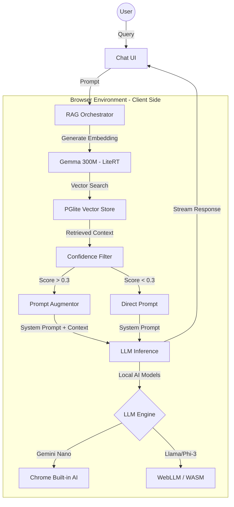

## Introducing Buddhi AI: The Future of Private, Client-Side Intelligence

**Buddhi AI** is a cutting-edge web application designed to harness the power of artificial intelligence directly within the user's browser, fundamentally changing the paradigm of AI-powered tools. Built with a clear focus on **privacy and efficiency**, Buddhi AI is aligned with and leverages the evolving capabilities of modern web browsers, notably through the integration of **Chrome’s Built-in AI** features.

***

### 🔒 Core Philosophy: Privacy-First & Cost-Efficient AI

The guiding principle of Buddhi AI is to deliver robust AI utility while upholding the highest standards of user security and privacy.

* **Ultimate Privacy:** By primarily utilizing **client-side AI models**, computation is performed locally on the user's device. This ensures that sensitive data and prompts never have to be transmitted to or stored on a remote server, offering a level of **data privacy** that is unattainable with traditional cloud-based AI services.
* **Operational Efficiency:** Shifting the computational burden from the server to the client dramatically **reduces server-side computation cost**. This approach not only makes the service highly scalable but also environmentally sustainable and more cost-effective, allowing Buddhi AI to deliver powerful tools efficiently.

***

### 🧠 Models & RAG Architecture

Buddhi AI utilizes a sophisticated **Local-First RAG (Retrieval-Augmented Generation)** architecture to provide context-aware responses without compromising privacy.

#### Architecture Overview


#### Local Inference Models
- **LLMs:** Supports **Chrome Built-in AI (Gemini Nano)** and **WebLLM** (e.g., Llama 3, Phi-3) for browser-based text generation.
- **Embeddings:** Uses a custom **Gemma 300M** model via **LiteRT (TensorFlow.js)** to generate high-quality text embeddings directly in the browser.

#### Local Naive RAG Pipeline
1.  **Ingestion:** Documents are parsed and chunked client-side.
2.  **Vector Storage:** Uses **PGlite** (WASM version of PostgreSQL) with the `vector` extension for persistent, local vector storage.
3.  **Retrieval:** When a query is made, the system performs a similarity search in PGlite.
4.  **Confidence Filtering:** Implements threshold-based logic to ensure accuracy:
    - **Score < 0.3:** Skips RAG to avoid hallucinations from irrelevant context.
    - **Score 0.3 - 0.5:** Augments the prompt with context but flags a "low confidence" warning to the system.
5.  **Augmentation:** Relevant snippets are injected into the system prompt before the final inference.

***

### 💻 Developer Documentation

#### Tech Stack
- **Framework:** Next.js 15 (App Router)
- **Database:** PGlite (Postgres-in-the-browser)
- **RAG Orchestration:** LlamaIndex.ts
- **State Management:** Zustand
- **Styling:** Tailwind CSS 4 & Shadcn UI
- **Local AI:** WebLLM, Mediapipe, LiteRT (TensorFlow.js)

#### Getting Started
1. **Clone the repository:**
   ```bash
   git clone https://github.com/buddhilive/buddhi-ai.git
   cd buddhi-ai
   ```
2. **Install dependencies:**
   ```bash
   pnpm install
   ```
3. **Run the development server:**
   ```bash
   pnpm dev
   ```
4. **Environment Variables:**
   Create a `.env.local` file (optional, as most features are local-first).

#### Project Structure
- `src/app/`: Next.js application routes and main logic.
- `src/lib/`: Core providers (PGlite, LlamaIndex, Embeddings).
- `src/workers/`: Dedicated workers for heavy AI tasks (model downloading, embedding generation).
- `src/stores/`: Global state management using Zustand.
- `src/tools/`: Definitions for agentic tools (e.g., web search).

***

### 🚀 Vision & Alignment

The development of Buddhi AI is strategically aligned with the pioneering work on client-side AI models, as championed by modern browser technologies. Our vision is an **ever-expanding collection of useful tools** that continuously adopts new, powerful on-device models as they become available.

Buddhi AI is more than just a set of tools; it is a platform championing the shift towards a more distributed, private, and accessible AI ecosystem, making intelligent assistance an inherent and secure capability of the modern web experience.