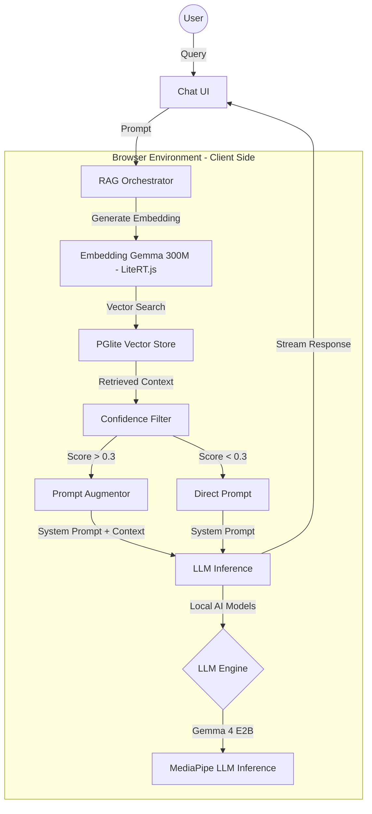

# Buddhi AI: The Future of Private, Client-Side Intelligence


**Buddhi AI** is a cutting-edge web application designed to harness the power of artificial intelligence directly within the user's browser, fundamentally changing the paradigm of AI-powered tools. Built with a clear focus on **privacy and efficiency**, Buddhi AI leverages modern web capabilities and client-side models to deliver fully private AI assistance.

***

### Core Philosophy: Privacy-First & Cost-Efficient AI

The guiding principle of Buddhi AI is to deliver robust AI utility while upholding the highest standards of user security and privacy.

* **Ultimate Privacy:** By utilizing **client-side AI models**, computation is performed locally on the user's device. This ensures that sensitive data and prompts never have to be transmitted to or stored on a remote server, offering a level of **data privacy** that is unattainable with traditional cloud-based AI services.
* **Operational Efficiency:** Shifting the computational burden from the server to the client dramatically **reduces server-side computation cost**. This approach not only makes the service highly scalable but also environmentally sustainable and more cost-effective, allowing Buddhi AI to deliver powerful tools efficiently.

***

### Core Features

- **Local-First Chat:** Fully interactive chat powered entirely by client-side models (Gemma 4 E2B) running in WebGPU or WASM modes.
- **Local RAG (Retrieval-Augmented Generation):** Upload documents (TXT, PDF, MD) to the browser, chunk, embed, and index them into an in-browser database to query context-aware answers.
- **Prompt Builder:** A custom interface allowing users to craft, customize, and experiment with system prompts and model templates to modify model responses.
- **Model Manager:** Visual interface to download and manage model files (such as Gemma 4 and Embedding Gemma 300M) locally using a streaming progress worker.

***

### Models & RAG Architecture

Buddhi AI utilizes a sophisticated **Local-First RAG** architecture to provide context-aware responses without compromising privacy.

#### Architecture Overview


#### Local Inference Models
- **LLMs:** Primarily supports **MediaPipe LLM Inference library (Gemma 4 E2B)** with template formatting optimized for `gemma4`. Backwards compatibility support is also provided for legacy `gemma3n`.
- **Embeddings:** Uses **Embedding Gemma 300M** via **LiteRT.js** to generate high-quality text embeddings directly in the browser.

#### Local Naive RAG Pipeline
1.  **Ingestion:** Documents are parsed and chunked client-side using sentence splitters.
2.  **Vector Storage:** Uses **PGlite** (WASM version of PostgreSQL) with the `vector` extension for persistent, local vector storage.
3.  **Retrieval:** When a query is made, the system performs a similarity search in PGlite.
4.  **Confidence Filtering:** Implements threshold-based logic to ensure accuracy:
    - **Score < 0.3:** Skips RAG to avoid hallucinations from irrelevant context.
    - **Score 0.3 - 0.5:** Augments the prompt with context but flags a "low confidence" warning to the system.
5.  **Augmentation:** Relevant snippets are injected into the system prompt before the final inference.

***

### Developer Documentation

#### Tech Stack
- **Framework:** Next.js 16 (App Router)
- **React Version:** React 19
- **Database:** PGlite (Postgres-in-the-browser)
- **RAG Orchestration:** LlamaIndex.ts
- **State Management:** Zustand
- **Styling:** Tailwind CSS 4 & Shadcn UI
- **Local AI:** MediaPipe LLM Inference library, LiteRT.js (TensorFlow Lite runtime)

#### Getting Started
1. **Clone the repository:**
   ```bash
   git clone https://github.com/buddhilive/buddhi-ai.git
   cd buddhi-ai
   ```
2. **Install dependencies:**
   ```bash
   pnpm install
   ```
3. **Run the development server:**
   ```bash
   pnpm dev
   ```

***

### Vision & Alignment

The development of Buddhi AI is strategically aligned with the pioneering work on client-side AI models. Our vision is an **ever-expanding collection of useful tools** that continuously adopts new, powerful on-device models as they become available.

Buddhi AI is more than just a set of tools; it is a platform championing the shift towards a more distributed, private, and accessible AI ecosystem, making intelligent assistance an inherent and secure capability of the modern web experience.