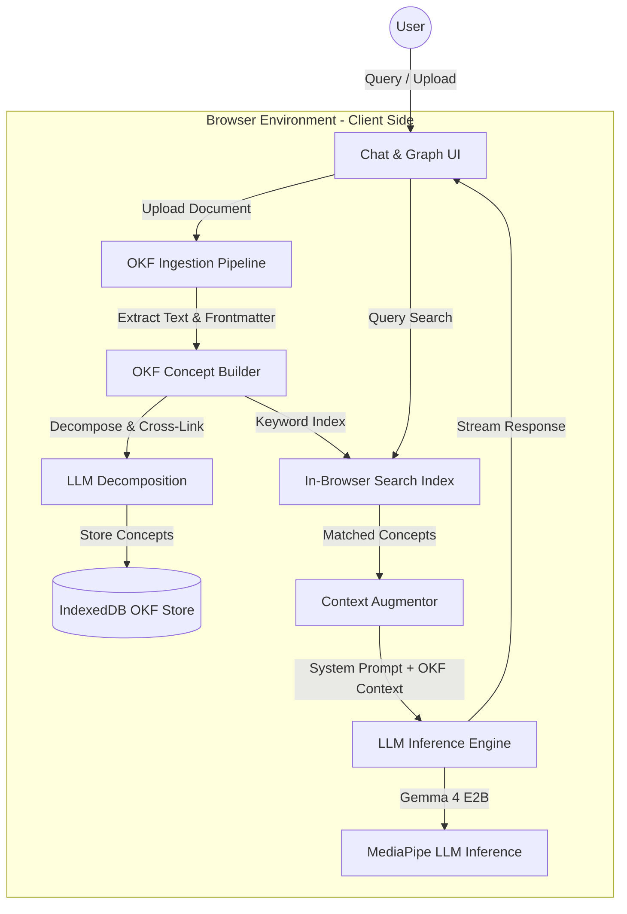

# Buddhi AI: The Future of Private, Client-Side Intelligence


**Buddhi AI** is a cutting-edge web application designed to harness the power of artificial intelligence directly within the user's browser, fundamentally changing the paradigm of AI-powered tools. Built with a clear focus on **privacy and efficiency**, Buddhi AI leverages modern web capabilities and client-side models to deliver fully private AI assistance.

***

### Core Philosophy: Privacy-First & Cost-Efficient AI

The guiding principle of Buddhi AI is to deliver robust AI utility while upholding the highest standards of user security and privacy.

* **Ultimate Privacy:** By utilizing **client-side AI models**, computation is performed locally on the user's device. This ensures that sensitive data and prompts never have to be transmitted to or stored on a remote server, offering a level of **data privacy** that is unattainable with traditional cloud-based AI services.
* **Operational Efficiency:** Shifting the computational burden from the server to the client dramatically **reduces server-side computation cost**. This approach not only makes the service highly scalable but also environmentally sustainable and more cost-effective, allowing Buddhi AI to deliver powerful tools efficiently.

***

### Core Features

- **Local-First Chat:** Fully interactive chat powered entirely by client-side models (Gemma 4 E2B) running in WebGPU or WASM modes.
- **Open Knowledge Format (OKF) System:** Ingests documents (PDF, TXT, MD) and decomposes them into structured, cross-linked Markdown concepts following the OKF v0.2 specification. Metadata (provenance, trust, lifecycle) and relationship graphs are stored locally.
- **Interactive Knowledge Graph:** Visualizes cross-linked concepts using Cytoscape.js, featuring color-coded concept categories, edge relation kinds, zoom controls, hover metadata, and neighborhood isolation.
- **Prompt Builder & Selector:** A custom interface allowing users to craft, customize, and experiment with system prompts and model templates to modify model responses.
- **Model Manager:** Visual interface to download and manage model files (such as Gemma 4 E2B) locally using a streaming progress worker without requiring external access tokens.

***

### Open Knowledge Format (OKF) Architecture

Buddhi AI replaces traditional embedding-based RAG with an **Open Knowledge Format (OKF) v0.2** knowledge management system. Documents are parsed into structured Markdown concepts with YAML frontmatter, cross-linked into a concept graph, and indexed for fast, local context-aware retrieval.

#### Architecture Overview

```mermaid
graph TD
    User((User)) -->|Query / Upload| UI[Chat & Graph UI]
    
    subgraph Browser_Environment [Browser Environment - Client Side]
        direction TB
        UI -->|Upload Document| ING[OKF Ingestion Pipeline]
        ING -->|Extract Text & Frontmatter| CON[OKF Concept Builder]
        CON -->|Decompose & Cross-Link| DEC[LLM Decomposition]
        DEC -->|Store Concepts| IDB[(IndexedDB OKF Store)]
        CON -->|Keyword Index| IDX[In-Browser Search Index]

        UI -->|Query Search| IDX
        IDX -->|Matched Concepts| AUG[Context Augmentor]
        
        AUG -->|System Prompt + OKF Context| INF[LLM Inference Engine]
        INF -->|Gemma 4 E2B| MP[MediaPipe LLM Inference]
    end
    
    INF -->|Stream Response| UI
```

#### Local Inference Models
- **LLMs:** Primarily supports **MediaPipe LLM Inference library (Gemma 4 E2B)** with template formatting optimized for `gemma4`. Gemma 4 is publicly available and requires no access tokens.
- **Open Knowledge Engine:** Uses local text extraction and optional on-device LLM enrichment/decomposition to structure unstructured text into OKF Markdown concepts with YAML frontmatter metadata (`type`, `title`, `sources`, `generated`, `tags`).

#### OKF Ingestion & Processing Pipeline
1. **Document Ingestion:** Reads uploaded PDF, TXT, and MD files client-side.
2. **OKF Concept Building:** Extracts content and constructs primary OKF concepts with standard YAML frontmatter metadata.
3. **LLM Enrichment & Decomposition:** When an on-device model is ready, best-effort LLM processing enriches concept metadata and decomposes large documents into cross-linked sub-concepts (`/concept-id.md`).
4. **Local Indexing & Graph Construction:** Persists concepts in IndexedDB, indexes text into an inverted keyword search index, and builds Cytoscape.js interactive graph elements.
5. **Context Augmentation:** Relevant OKF concept markdown snippets are injected directly into system prompts for context-aware responses.

***

### Developer Documentation

#### Tech Stack
- **Framework:** Next.js 16 (App Router)
- **React Version:** React 19
- **Knowledge Engine:** Open Knowledge Format (OKF v0.2)
- **Graph Visualization:** Cytoscape.js
- **State Management:** Zustand
- **Styling:** Tailwind CSS 4 & Shadcn UI
- **Local AI:** MediaPipe LLM Inference library (Gemma 4 E2B)

#### Getting Started
1. **Clone the repository:**
   ```bash
   git clone https://github.com/buddhilive/buddhi-ai.git
   cd buddhi-ai
   ```
2. **Install dependencies:**
   ```bash
   pnpm install
   ```
3. **Run the development server:**
   ```bash
   pnpm dev
   ```

***

### Vision & Alignment

The development of Buddhi AI is strategically aligned with the pioneering work on client-side AI models and open knowledge standards. Our vision is an **ever-expanding collection of useful tools** that continuously adopts new, powerful on-device models as they become available.

Buddhi AI is more than just a set of tools; it is a platform championing the shift towards a more distributed, private, and accessible AI ecosystem, making intelligent assistance an inherent and secure capability of the modern web experience.